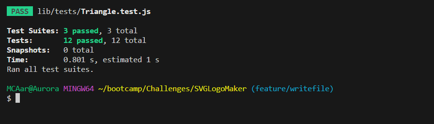

# SVGLogoMaker

Video Link : https://www.youtube.com/watch?v=KytM-g39Ejk
Protected by a  [License](#license)

## Description

This app is used to make simple svg logos and was all around simple. I mainly wanted to learn about the testing proceudure and sytax here. I had a lot of issues with it. Im supper hapy with how it came out and am eager to learn more about the testing procedure>. I didnt use the synatx provided for a test I made my own with diffrent synatx.

## Table of Contents

- [Installation](#installation)
- [Usage](#usage)
- [Credits](#credits)
- [License](#license)
- [Tests](#Tests)
- [Questions](#Questions)

## Installation

prerequisite have node (https://nodejs.org/en) and and command line interface 

1) install this applicaion onto the selected area of a your computer and use the command line and get into the svg logo maker file

2) run the (npm init) command in the command line 

3) run the (npm i inquirer)

## Usage

This app is used to make simple svg logos

## Credits

Used to make read me https://github.com/jbird11801/ReadMeGenerator

Used to make badge https://shields.io/

Used to run tests https://www.npmjs.com/package/jest

Used to ask questions https://www.npmjs.com/package/inquirer

Used to learn about svgs https://developer.mozilla.org/en-US/docs/Web/SVG/Tutorial/Basic_Shapes

Used to help make svgs https://marketplace.visualstudio.com/items?itemName=jock.svg

## License

This project has the (MIT) license protecting it!

Please refer to license file 

## Tests

I used npm jest to test my project 

## Questions

Please contact me about this project here [jbird11801@yahoo.com](mailto:jbird11801@yahoo.com)
            
My git hub account is jbird11801 at https://github.com/jbird11801
